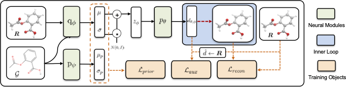
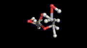

# ConfVAE for Conformation Generation



[[arXiv](https://arxiv.org/abs/2105.07246)] [[Code](https://github.com/MinkaiXu/ConfVAE-ICML21)]

This is the official code repository of our ICML paper "An End-to-End Framework for Molecular Conformation Generation via Bilevel Programming" (2021).

## Installation

### Install via Conda (Recommended)

Follow the instructions [here](https://github.com/MinkaiXu/CGCF-ConfGen#install-via-conda-recommended). We adopt the same environment as another our previous repo.

### Install Manually

```bash
# Create conda environment
conda create --name ConfVAE python=3.7

# Activate the environment
conda activate ConfVAE

# Install packages
conda install pytorch torchvision cudatoolkit=10.2 -c pytorch
conda install rdkit==2020.03.3 -c rdkit
conda install tqdm networkx scipy scikit-learn h5py tensorboard -c conda-forge
pip install torchdiffeq==0.0.1

# Install PyTorch Geometric
conda install pytorch-geometric -c rusty1s -c conda-forge
```

## Data

### Official Datasets

The official datasets are available [here](https://drive.google.com/drive/folders/1UTxgyWeXbgDehV1okdZ2UkKwZbe3I0hO?usp=sharing).

### Input Format / Make Your Own Datasets

The dataset file is a pickled Python list consisting of [``rdkit.Chem.rdchem.Mol``](https://www.rdkit.org/docs/source/rdkit.Chem.rdchem.html#rdkit.Chem.rdchem.Mol) objects. Each conformation is stored individually as a `Mol` object. For example, if a dataset contains 3 molecules, where the first molecule has 4 conformations, the second one and the third one have 5 and 6 conformations respectively, then the pickled Python list will contain 4+5+6 `Mol` objects in total.

### Output Format

The output format is identical to the input format.

## Usage

### Train

Example: training a model for QM9 molecules.

```bash
python train_vae.py \
    --train_dataset ./data/qm9/train_QM9.pkl \
    --val_dataset ./data/qm9/val_QM9.pkl
```

More training options can be found in `train_vae.py`.

### Generate Conformations

Example: generating conformations for each molecule in the QM9 test-split, with twice the number of test set for each molecule.

```bash
python eval_vae.py \
    --ckpt ./logs/VAE_QM9 \
    --dataset ./data/iclr/qm9/test_QM9.pkl \
    --num_samples -2
```

More generation options can be found in `eval_vae.py`.

## Citation

Please consider citing our work if you find it helpful.

```
@inproceedings{
  xu2021end,
  title={An End-to-End Framework for Molecular Conformation Generation via Bilevel Programming},
  author={Xu, Minkai and Wang, Wujie and Luo, Shitong and Shi, Chence and Bengio, Yoshua and Gomez-Bombarelli, Rafael and Tang, Jian},
  booktitle={International Conference on Machine Learning},
  year={2021}
}
```

## Contact

If you have any question, please contact me at <minkai.xu@umontreal.ca> or <xuminkai@mila.quebec>.


-----


# 📢 Attention

Please also check our another concurrent work on molecular conformation generation, which has also been accepted in ICML'2021 (Long Talk): [Learning Gradient Fields for Molecular Conformation Generation](https://arxiv.org/abs/2105.03902). [[Code](https://github.com/DeepGraphLearning/ConfGF)]


